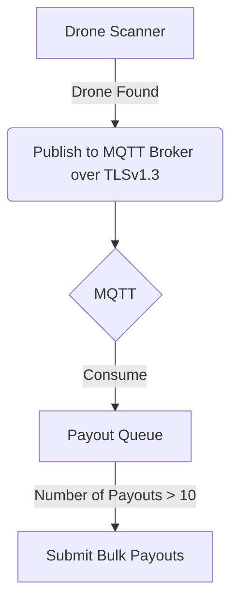

# Description

This was a DePIN Oracle that consumed miner submissions via miner software, which I named Trebuchet. The miner software is in another repository that I'm debating on open-sourcing for personal reasons. However, the miner essentially scanned over Bluetooth LTE Announcements and WiFi Beacon signals and ingested packets that matched the Remote ID / Open DroneID protocol, [implemented by the FAA](https://www.faa.gov/uas/getting_started/remote_id). It would then submit these payloads via an MQTT host with TLSv1.3 encryption, where this Oracle would consume those submissions, do some math on payouts, and handle the economy accordingly.

Regarding the TLSv1.3 encryption, the plan was that certificates for the individual machines would be issued via this Oracle and assigned a "Wallet" -- although, the certs don't care about a wallet for now, just that they match up.

I'm not an economist, I'm a programmer - so the crypto economy in this Oracle may not be the best design ever.

# Flow

An example bulk payout can be seen here on Solana's devnet: https://explorer.solana.com/tx/3K2gFZMCiv4GFqBNz8P8GfqoAhw2P9Rkp8VaNSnUJAdHgo9rJJw8EVEtEYXZgrbQqQsmfgZdFgTswJKWUB54R5P6?cluster=devnet

## Potential FAQs

### What Happened?

This project's code was done by myself while the rest of the project was done by group of people involved in the DePIN (**De**centralized **P**hysical **I**nfrastructure **N**etwork) world of cryptocurrency. It's basically a way for crypto to be involved in renting or selling equipment out. I honestly just wanted an excuse to learn Rust, and this seemed like a cool project to do it in; however, the team wanted to shift focus from drone mining - mainly because the traffic could be spoofed very easily - and wanted to do a random memecoin.

I did not have time to adjust this codebase after putting hours and hours of work into this during my paternity leave, and I just had twins. However, according to the influencer via a Tweet (I will not name his name out of respect), I flaked out. I reached out to him personally, and received no reply for a number of weeks.

That is why I'm open sourcing this. That and I'm the sole contributor to this codebase, and there was nothing signed preventing me in doing so.

### Why the License?

I learned a lot on this project. I want others to learn what I learned - as well as showcase my work, and perhaps receive feedback on my Rust code via an issue if anyone would like to.

# Getting Started

1. Generate certs (`openssl` required)
  - `make bootstrap_ca` to generate the Certificate Authority
  - `make bootstrap_server` to generate the server certificate and key, signed with the CA -- this is for the MQTT broker
  - `make bootstrap_client` to generate the client certificate and key, signed with the CA -- this is for the Oracle

2. Run the stack with `docker compose up -d`
3. Send a test message with `make send_message`

## Setting up with Solana's Devnet

1. `make solana_devnet`
2. `make solana_create_wallet`
3. `make solana_fund_wallet` or go to https://faucet.solana.com and do this for `devnet` manually; sometimes the CLI doesn't work
4. `make solana_create_token`
5. `make solana_create_token_account`
6. `make solana_mint_token` -- optional

You'll modify `oracle.yml` with the proper `mint_address`
